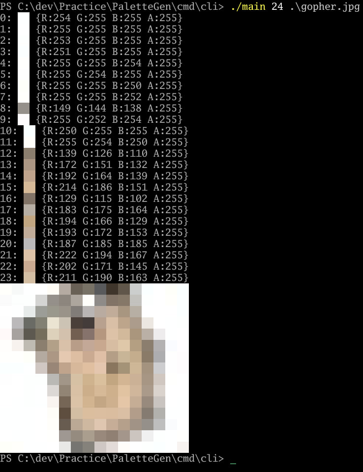
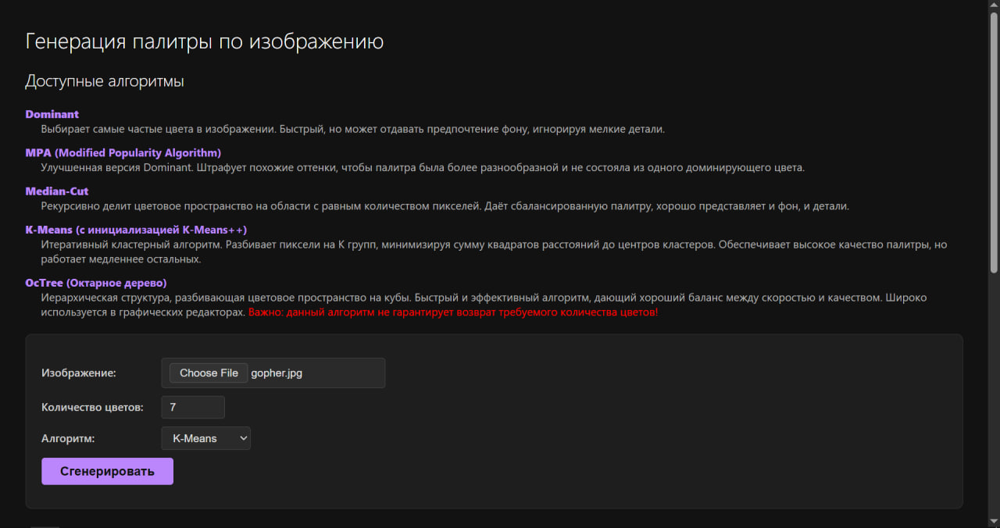
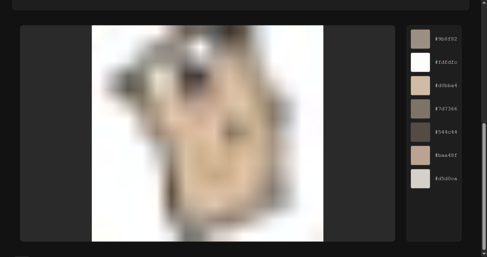

# Учебная практика за второй курс

Короче это просто задание по учебной практике на второй курс. Тема индивидуального задания: "Генератор цветовых палитр". Суть задания в следующем - разработать программу, которая способна:
- Анализировать доминирующие цвета изображения;
- Создавать палитру из 5-7 основных цветов;
- Визуализировать палитру рядом с изображением.

Было реализовано 5 алгоритмов:
1. Dominant - самая прямолинейная интерпритация задания, возвращает самые частовстречающиеся цвета.
2. MPA (Modified Popularoty Algorithm) - по идее должен быть лучше первого, но разницы в выводе абсолютно никакой.
3. Median-Cut - вот это уже интересный, рекурсивно делит цвета изображения на "вёдра" по медианам самых разнообразных каналов и возвращает средние значения этих вёдер.
4. K-Means - настолько мудрёный что мне лень объяснять, вбейте в википедии. Инциализация централей реализована через K-Means++.
5. OcTree - сортирует цвета изображения по октальному дереву и сворачивает его. Очень часто не способен вернуть необходимое количество цветов из-за особенности сворачивания. Зато работает быстро.

Веб-интерфейс реализован с помощью templ и HTMX. CSS полностью написан ИИ.

## Скриншоты

### CLI

### Web

